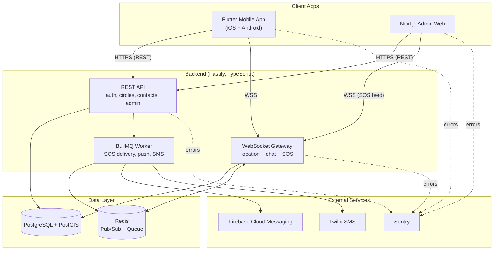

# 01 — System Architecture

## Overview
FamShare is a three-application system sharing one backend: a Flutter mobile app (primary user surface), a Fastify API + realtime layer (backend), and a Next.js admin dashboard (moderation/monitoring). All three live in one monorepo and talk to a single Postgres+PostGIS database.

## Component Diagram (Mermaid — renders on GitHub/most markdown viewers)

## Layer Responsibilities

### Mobile app (Flutter)
- Captures and streams GPS location in the background (motion-adaptive, battery-conscious)
- Renders the live map of circle members
- Handles auth (login, token storage via `flutter_secure_storage`)
- Sends/receives chat messages over WebSocket
- Triggers SOS and manages emergency contacts
- Displays sharing-status indicator and pause/ghost mode toggle (Tier 1)

### Backend — REST API (Fastify)
- Auth endpoints (register, login, refresh, logout)
- Circle CRUD, membership management
- Emergency contact CRUD
- Admin-only endpoints (user/circle moderation, analytics)
- Issues short-lived JWT access tokens + longer-lived refresh tokens

### Backend — WebSocket gateway
- Accepts authenticated WS connections from mobile + admin web
- Broadcasts location updates to circle members in real time
- Routes chat messages within a circle
- Broadcasts SOS trigger events to circle members and to the admin dashboard's live feed
- Uses Redis Pub/Sub as the fan-out layer so this can scale horizontally later (single instance is fine for MVP, but the pattern is in place from day one)

### Backend — Queue worker (BullMQ + Redis)
- Consumes SOS-trigger jobs and handles delivery with retries: FCM push → SMS fallback via Twilio if push fails or isn't acknowledged within a threshold
- Decouples "SOS was triggered" (must be instant, must never be lost) from "notification was delivered" (may need retries)

### Data layer
- **PostgreSQL + PostGIS**: source of truth for users, circles, locations, messages, emergency contacts, SOS events. PostGIS enables geofence containment queries for Tier 1 place alerts.
- **Redis**: Pub/Sub backplane for WebSocket fan-out, plus the BullMQ job queue for SOS delivery.

### Admin web (Next.js)
- Separate admin auth (not a regular user account)
- Server-rendered dashboard: user list, circle list, live SOS feed (subscribes to the same WebSocket gateway), basic analytics queries against Postgres

## Data Flow Summary (detail in 07-data-flow)
1. Mobile app streams location → WebSocket gateway → written to Postgres + broadcast to circle members' open connections
2. Chat message → WebSocket gateway → written to Postgres → broadcast to circle members
3. SOS trigger → WebSocket gateway (instant broadcast to circle + admin feed) AND enqueued to BullMQ → worker sends FCM push, retries with SMS via Twilio on failure/no-ack

## Why this architecture (rationale)
- **Fastify over Express**: lower overhead, native TypeScript-friendly, matches your existing School Connect backend conventions
- **WebSocket over pure polling**: location and chat both need low-latency push, and polling would waste battery/bandwidth on mobile — directly conflicts with the battery-efficiency goal from the feature research
- **Redis Pub/Sub from day one, even at single-instance scale**: cheap to add now, expensive to retrofit later if you ever need to run multiple backend instances
- **BullMQ queue specifically for SOS**: this is the one place reliability matters more than simplicity — a direct, unqueued API call to FCM/Twilio with no retry logic is a single point of failure for your most safety-critical feature
- **PostGIS**: purpose-built for geofence/proximity queries (`ST_DWithin`, `ST_Contains`), avoids hand-rolling distance math in application code

## Environments
| Environment | Backend | Admin Web | Database |
|---|---|---|---|
| Local dev | Docker Compose (Fastify container) | `next dev` | Dockerized Postgres+PostGIS + Redis |
| Staging | Railway/Fly.io (staging service) | Vercel preview deployment | Managed Postgres (staging instance) |
| Production | Railway/Fly.io (prod service) | Vercel production | Managed Postgres (prod instance, PostGIS enabled) |

## Open Questions to Resolve Before Building
- Managed Postgres provider for PostGIS support (Supabase, Railway, Neon — confirm PostGIS extension availability on chosen tier)
- Whether WebSocket gateway and REST API run as one Fastify process or two separate services (MVP recommendation: one process, split later only if scaling requires it)
